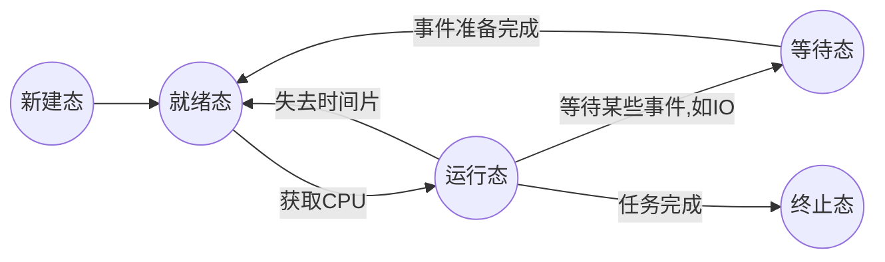
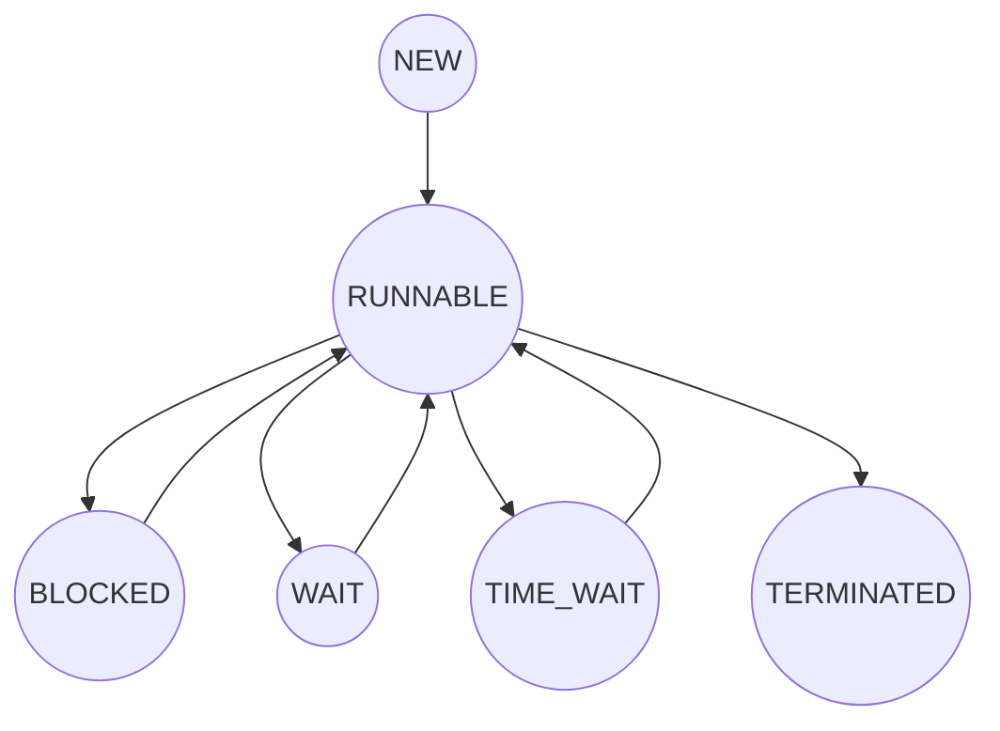
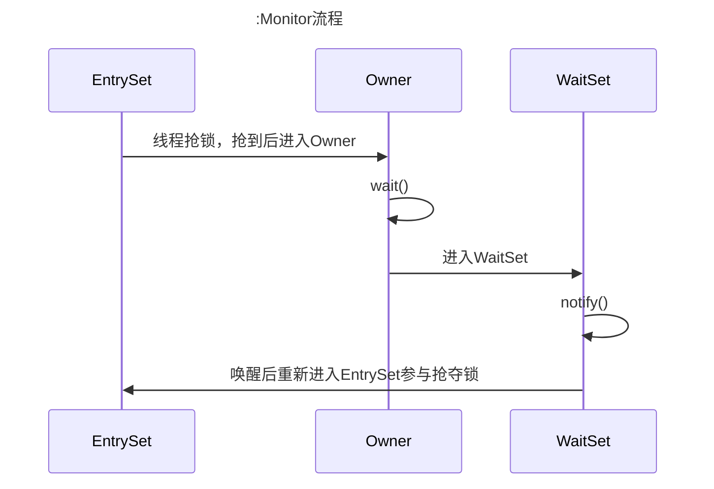
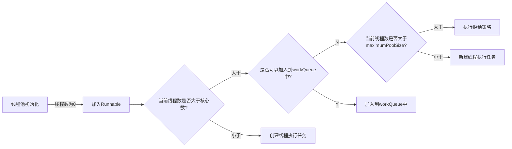

# JAVA并发

## 线程状态

操作系统的线程状态：




java线程状态：



| 操作系统线程状态   | JVM线程状态            |
| ------------------ | ---------------------- |
| 新建态(NEW)        | NEW                    |
| 就绪态(READY)      | RUNNABLE               |
| 运行态(RUNNING)    | RUNNABLE               |
| 等待态(WAIT)       | BLOCK，WAIT，TIME_WAIT |
| 终止态(TERMINATED) | TERMINATED             |

可以看到，java线程与操作系统大致相同，也有不同的地方，按照常理来说，java线程的运行状态应该是操作系统的运行态(`RUNING`),但是为什么是`RUNNABLE`，这是因为一个线程是否获取到CPU，是否操作系统级别决定的，JVM无法操控，所以将线程状态标记为可运行的，具体是否运行，交给操作系统来调度

而等待态被JVM分成三种状态。

## 线程状态切换

### NEW

当使用`Thread thread = new Thread()`时，该线程还没有运行，即是新建(NEW)状态。此时还没有托管到操作系统

### RUNNABLE

使用`Thread.start()`即可将线程状态标记为`RUNNABLE`

### WAIT

进入该状态的方式有很多，比如调用wait(),park(),join()

比如join()状态，如以下代码：

```java
 public static void main(String[] args) throws InterruptedException {
        Thread thread = new Thread(() -> {
            while (i<2000000000){
                i++;
            }
        },"自定义线程");
        System.out.println(i);
        thread.start();
        thread.join();
        System.out.println(i);
    }
```

将线程状态dump下来看，可以看到以下状态

> "自定义线程" #11 prio=5 os_prio=0 tid=0x000000001dfd1800 nid=0xda4 runnable [0x000000001e97f000]
>    java.lang.Thread.State: RUNNABLE
>         at com.mzl.network.thread.Thread1.lambda$main$0(Thread1.java:9)
>         at com.mzl.network.thread.Thread1$$Lambda$1/990368553.run(Unknown Source)
>         at java.lang.Thread.run(Thread.java:748)
>
>    Locked ownable synchronizers:
>         - None
>
> ------------------------------------------------------------------------------------------------------------------------
>
> "main" #1 prio=5 os_prio=0 tid=0x00000000015be000 nid=0x3cd8 in Object.wait() [0x0000000002e8f000]
>    java.lang.Thread.State: WAITING (on object monitor)
>         at java.lang.Object.wait(Native Method)
>
>         - waiting on <0x00000006c3c04a68> (a java.lang.Thread)
>                 at java.lang.Thread.join(Thread.java:1252)
>                 - locked <0x00000006c3c04a68> (a java.lang.Thread)
>                         at java.lang.Thread.join(Thread.java:1326)
>                         at com.mzl.network.thread.Thread1.main(Thread1.java:14)
>
>    Locked ownable synchronizers:
>         - None

可以看到`自定义线程`处于`RUNNABLE`状态，主线程调用了`join()`所以状态处于`WATING`

`java.lang.Thread.State: WAITING (on object monitor)`这句话说明该线程进入`WATING`状态是因为对象监视器造成的

### TIME_WATING

使用`Thead.sleep(time)`,`wait(time)`即可使线程状态进入`TIME_WAITING`状态,如下代码：

```java
public static void main(String[] args) throws InterruptedException {
        Thread thread = new Thread(() -> {
            while (i<2000000000){
                i++;
            }
        },"自定义线程");
        System.out.println(i);
        thread.start();
        Thread.sleep(30000);
        System.out.println(i);
    }
```


可以看到dump后的线程信息：

> "main" #1 prio=5 os_prio=0 tid=0x000000000299e000 nid=0x4f4 waiting on condition [0x000000000108f000]
>    java.lang.Thread.State: TIMED_WAITING (sleeping)
>         at java.lang.Thread.sleep(Native Method)
>         at com.mzl.network.thread.Thread1.main(Thread1.java:14)
>
>    Locked ownable synchronizers:
>         - None

### BLOCKED

BLOCKED是指当前线程被阻塞在某个锁上，试图获取被一个其他线程已抢占的锁时会进入该状态，代码如下：

```java
Runnable runnable = () -> {
           synchronized (Thread1.LOCK){
               try {
                   Thread.sleep(100000);
               } catch (InterruptedException e) {
                   throw new RuntimeException(e);
               }
           }
       };
       Thread threadA = new Thread(runnable);
       Thread threadB = new Thread(runnable);
       threadA.start();
       threadB.start();
```

可以看到该线程信息:

>"Thread-1" #12 prio=5 os_prio=0 tid=0x000000001df5b800 nid=0x20b8 waiting for monitor entry [0x000000001e98f000]
>   java.lang.Thread.State: BLOCKED (on object monitor)
>        at com.mzl.network.thread.Thread1.lambda$main$0(Thread1.java:13)
>
>        - waiting to lock <0x000000076c03fbd0> (a java.lang.Object)
>                at com.mzl.network.thread.Thread1$$Lambda$1/990368553.run(Unknown Source)
>                at java.lang.Thread.run(Thread.java:748)
>
>   Locked ownable synchronizers:
>        - None
>
>"Thread-0" #11 prio=5 os_prio=0 tid=0x000000001df59000 nid=0x5d0 waiting on condition [0x000000001e88e000]
>   java.lang.Thread.State: TIMED_WAITING (sleeping)
>        at java.lang.Thread.sleep(Native Method)
>        at com.mzl.network.thread.Thread1.lambda$main$0(Thread1.java:13)
>        - locked <0x000000076c03fbd0> (a java.lang.Object)
>        at com.mzl.network.thread.Thread1$$Lambda$1/990368553.run(Unknown Source)
>        at java.lang.Thread.run(Thread.java:748)
>
>   Locked ownable synchronizers:
>        - None


## Monitor

Monitor是一种同步机制，保证同一时间只有一个线程可以访问被保护的数据和代码

JVM同步是基于进入和退出监视器对象来实现的，每个对象实例都会有一个Monitor对象，Java对象头中有`Mark Word`中会指向一个Monitor对象

Monitor可以理解为有三个字段:

- WaitSet
- EntrySet
- owner

如图



每个Java对象中都会有一个锁，锁可以有开放状态，即线程可以*直接*访问,也可以是分配了钥匙的锁。需要对某个对象进行锁检测的关键字是`synchronized`

这个就可以回答**为什么wait()和notify()**只能在`synchronized`代码块中使用：

如果不在`synchronized`代码块中，那么就不会进行锁检测，就不会有Owner持有者，自然也不会调用notify和wait来进行线程间通信了

那还有个问题：为什么`wait()`设计在`Object`中，而不是`Thread`中？

1. wait和notify而本身是被设计用于线程同步和线程间通信的机制，而不是用于线程控制。线程是用于执行流相关联的，而对象是用于共享数据和线程间通信，所以设计到Object中更为合适
2. Java中每个对象都可以被作为锁
3. 如果不设计到`Object`中，那么`Object.wait()`方法也可以变为`thread.wait(object)`

## 线程池

### 分类

线程池有两种选择：

- ScheduledThreadPoolExecutor：定时任务或周期性任务
- ThreadPoolExecutor:一次性，立刻执行的任务

### 参数

线程池构造器：

```java
public ThreadPoolExecutor(int corePoolSize,
                              int maximumPoolSize,
                              long keepAliveTime,
                              TimeUnit unit,
                              BlockingQueue<Runnable> workQueue,
                              ThreadFactory threadFactory,
                              RejectedExecutionHandler handler)
```

- corePoolSize：线程池主要用于执行任务的是核心线程，核心线程的数量是根据`corePoolSize`参数决定的。如果不进行特别的设定，线程池中始终会保持corePoolSize数量的线程数（不包括创建阶段）,值得注意的是，该参数是可以为0的，表示线程池中没有保持活动状态的线程。这意味着线程池不会自动创建线程来处理任务，而是在有任务提交时动态地创建线程来执行任务。
- maximumPoolSize:一旦任务数量过多（由等待队列的特性决定），线程池将创建“非核心线程”临时帮助运行任务。设置的大于`corePoolSize`参数小于maximumPoolSize参数的部分，就是线程池可以临时创建的“非核心线程”的最大数量。这种情况下如果某个线程没有运行任何任务，在等待`keepAliveTime`时间后，这个线程将会被销毁，直到线程池的线程数量重新达到`corePoolSize`。
- workQueue：`corePoolSize`个线程处理不过来的时候会将任务先加入到workQueue中，要求队列必须是`BlockingQueue`的实现类。具体有以下：
  - 有界队列：
    - SynchronousQueue：一个容量都没有的队列，只有前一个元素被移除了，后一个元素才可以加入，否则一直等待
    - ArrayBlockingQueue：有界阻塞队列
  - 无界队列(是有最大容量的，为Integer.MAX_VALUE)：
    - LinkedBlockingQueue:可以指定容量，也可以不指定，指定容量后
    - LinkedBlockingDeque：双端队列
    - PriorityBlockingQueue：是一个按照优先级进行内部元素排序的无限队列，其任务要实现`Comparable`接口，可以通过该接口方法进行排序
    - LinkedTransferQueue


- threadFactory:线程工厂，如果没有指定，则会默认使用`Executors.defaultThreadFactory()`
- RejectedExecutionHandler：拒绝策略，当提交一个任务给线程池，但是线程池无法被核心线程处理，无法加入到等待队列，也无法创建新的线程来处理；或者该线程池已经shutDown了，这个时候线程池会拒绝执行这个任务，然后触发指定的拒绝策略。拒绝策略应是实现`RejectedExecutionHandler`接口。已有：
  - AbortPolicy：抛出异常
  - CallerRunsPolicy：将任务交给调用者线程来执行，即谁交给我的，我再交还回去
  - DiscardOldestPolicy：丢掉老的任务
  - DiscardPolicy：默默丢掉

### 流程

关于参数，有给人很大的迷惑性，很长时间我都认为如果有线程池初始化时会默认初始化`corePoolSize个`线程，如果`corePoolSize`个线程处理不过来，线程数会增加到`maximunPoolSize`个，之后的任务会加入到`workQueue`中,其实线程池执行任务应如下所示：



从上图可以看到线程池执行任务的流程

不常用的参数:

```java
ThreadPoolExecutor threadPoolExecutor = new ThreadPoolExecutor(3,10,3L, TimeUnit.SECONDS,new LinkedBlockingQueue<>(100));
// 允许核心线程也被回收,即线程池中所有线程都被回收
threadPoolExecutor.allowCoreThreadTimeOut(true);
// 预先初始化核心数个线程
threadPoolExecutor.prestartAllCoreThreads();
```

### 扩展

1. `shutdown()`，线程池收到该方法后，并不会立即停止，只是不会再接收任务了

2. 有时候可以继承`ThreadPoolExecutor`，该类提供了三个钩子方法，本身只是空实现：

   - beforeExecute：线程池执行每个任务之前会调用

   - afterExecute:线程池执行每个任务结束后会调用

   - terminated:线程池本身被关闭时被调用

3. `execute(Runnable command)`该方法接收`Runnable`类型的参数，不支持返回，若要支持返回请使用`submit(Callable<T> task)`,这里提一下，该类还支持`Future<?> submit(Runnable task);`也支持`Runnable`参数，但是实际执行或者想要在钩子方法中获取这个`Runnable`，需要做一个额外处理，因为钩子方法本身的`Runnable`并不是你传入的，是使用适配器处理过的

## Future

Future接口定义了操作异步任务执行的方法，提供了异步并行计算的能力

```java
// 关闭
boolean cancel(boolean mayInterruptIfRunning);
// 是否关闭
boolean isCancelled();
// 是否完成，无论成功失败
boolean isDone();
// 获取结果
V get() throws InterruptedException, ExecutionException;
// 获取结果+超时时间的
V get(long timeout, TimeUnit unit) throws InterruptedException, ExecutionException, TimeoutException;
```

一般可以将耗时的计算任务放入到异步线程中执行，然后主线程等待异步线程结束，通过Future获取结果

这么看，首先需要满足三个条件

1. 多线程
2. 有返回值
3. 异步任务

准确来说，创建线程只有一个Thread类，而实现线程的执行单元方式有很多，那么第一个`多线程`是可以满足的，使用Thread类即可，`有返回值`使用实现线程的执行单元的方式之一:`Callable`即可，但是有个问题，`Thread`的构造器只支持`Runnble`，即现有的不满足，

`FutureTask`三种都满足,即实现了`Runnble`与`Future`,且构造器实现了`Callable`.即可使用`FutureTask`完成异步并行计算且获取结果

```java
public class FutureTask<V> implements RunnableFuture<V> {
    public FutureTask(Callable<V> callable) {
        if (callable == null)
            throw new NullPointerException();
        this.callable = callable;
        this.state = NEW;
    }
}
```


## 临界区

多个线程访问**共享资源**

一段代码内存在多个线程对共享资源读写，称这段代码为**临界区**

**为了避免临界区的竞态条件发生，有多种手段可以达到目的**：

- 阻塞式：synchronized,Lock

- 非阻塞:原子变量

### Synchroized

`对象锁`，采用互斥的方式让同一时刻至多有一个线程能持有`对象锁`，其他线程想要获取这个`对象锁`是就会被阻塞住，这样就能保证拥有锁的线程可以安全的执行`临界区`的代码，不用担心线程上下文切换

```java
synchronized (LOCK){
     // 临界区
}
```

注意：**要保证是同一个对象**

